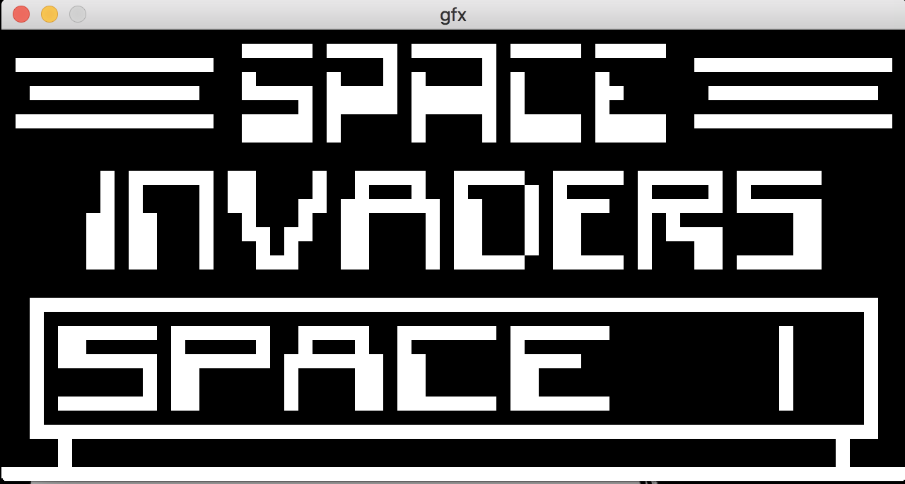
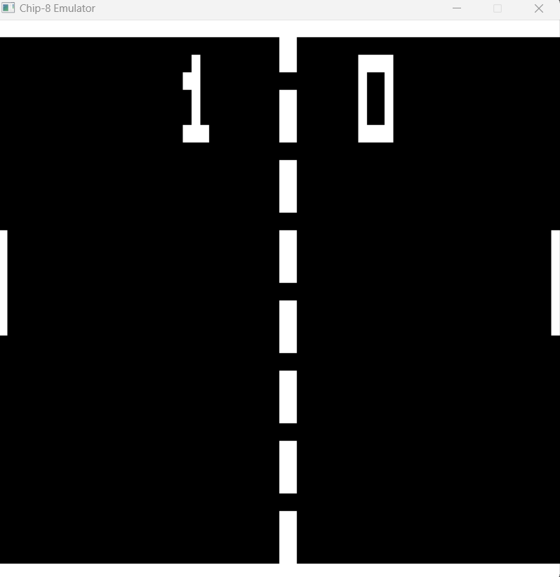

<a id="readme-top"></a>
<!-- PROJECT LOGO -->
<br />
<div align="center">
  
  

  <h3 align="center">Chip-8</h3>

  <p align="center">
    A Chip-8 interpreter created in C++ 
    <br />
  </p>
</div>


<!-- TABLE OF CONTENTS -->
<details>
  <summary>Table of Contents</summary>
  <ol>
    <li>
      <a href="#about-the-project">About The Project</a>
      <ul>
        <li><a href="#built-with">Built With</a></li>
      </ul>
    </li>
    <li>
      <a href="#getting-started">Getting Started</a>
      <ul>
        <li><a href="#installation">Installation</a></li>
      </ul>
    </li>
    <li><a href="#usage">Usage</a></li>
    <li><a href="#contact">Contact</a></li>
    <li><a href="#acknowledgments">Acknowledgments</a></li>
  </ol>
</details>


<!-- ABOUT THE PROJECT -->
## About The Project

[![Product Name Screen Shot][product-screenshot]](https://example.com)

The CHIP-8 was developed by Joseph Weisbecker in 1977 and was originally used on the COSMAC VIP and Telmac 1800 8-bit microcomputers. It's purpose was to simplify the creation of small programs and games for these computers. This project encompasses a CHIP-8 interpreter with its different components: memory, display, program counter, index register, stack, timers and registers.

<p align="right">(<a href="#readme-top">back to top</a>)</p>

### Built With

This section should list any major frameworks/libraries used to bootstrap your project. Leave any add-ons/plugins for the acknowledgements section. Here are a few examples.

* ![C++][C++]
* ![SDL][SDL]

<p align="right">(<a href="#readme-top">back to top</a>)</p>


<!-- GETTING STARTED -->
## Getting Started

In order to get this project running a build.sh and build.bat can be found under the root directory of the project. To get a local copy up and running follow these example steps. 

### Installation

1. Clone the repo. Be sure to include --recursive as it clones the vcpk module.
   ```sh
   git clone --recursive https://github.com/juanestrada17/Chip-8.git
   ```
2. If running on Windows. Over the root folder run:
   ```sh
   .\build.bat
   ```
4. If running on Mac or Linux. Over the root folder run:
   ```sh
   chmod +x build.sh
   ./build.sh
   ```
build.bat and build.sh will clone vcpkg repository and bootstrap it in order to manage packages and installing SDL2 required to render the graphics and map the controls. It will run the preset and build the project. Not that the build and .exe file will be stored over out/build/Chip8. 

<p align="right">(<a href="#readme-top">back to top</a>)</p>


<!-- USAGE EXAMPLES -->
## Usage

To run the Chip-8 interpreter we need to make use of the Chip8.exe executable. Altough the project provides 5 roms over the roms directory. Feel free to find more roms to test the interpreter online. In order to run pong, for example run the following command over root directory: 
```sh
  .\out\build\Chip8\Chip8.exe .\roms\pong2.ch8
```
<div align="center">
    
</div>

<p align="right">(<a href="#readme-top">back to top</a>)</p>


<!-- ROADMAP -->
## Roadmap

- [x] Create class to handle CHIP-8 Components
- [x] Create the SDL class that handles input and graphics
- [x] Add test roms to the application
- [x] Simplify setup by creating a script and provide some documentation 
- [ ] Create a ui debugger that displays the opcodes and components.


<p align="right">(<a href="#readme-top">back to top</a>)</p>


<!-- CONTACT -->
## Contact

Juan Estrada - [(https://www.linkedin.com/in/juan-estrada-a72959125/) - juanestrada17@outlook.com

Project Link: [https://github.com/juanestrada17/Chip-8](https://github.com/juanestrada17/Chip-8)

<p align="right">(<a href="#readme-top">back to top</a>)</p>


<!-- ACKNOWLEDGMENTS -->
## Acknowledgments

The most outstanding resources used to create this project were 

* [How to write an emulator(CHIP-8 interpreter)](https://multigesture.net/articles/how-to-write-an-emulator-chip-8-interpreter/)
* [Guide to making a CHIP-8 emulator](https://tobiasvl.github.io/blog/write-a-chip-8-emulator/)
* [Building a CHIP-8 emulator C++](https://austinmorlan.com/posts/chip8_emulator/)
* [Cowgod's Chip-8 Technical Reference](http://devernay.free.fr/hacks/chip8/C8TECH10.HTM)
* [CHIP-8 instruction Set](https://johnearnest.github.io/Octo/docs/chip8ref.pdf)
* [How to build a virtual machine from scratch](https://www.youtube.com/watch?v=BNXP0w4Ppto&ab_channel=PhilipBohun)

<p align="right">(<a href="#readme-top">back to top</a>)</p>


<!-- MARKDOWN LINKS & IMAGES -->
<!-- https://www.markdownguide.org/basic-syntax/#reference-style-links -->
[contributors-shield]: https://img.shields.io/github/contributors/othneildrew/Best-README-Template.svg?style=for-the-badge
[contributors-url]: https://github.com/othneildrew/Best-README-Template/graphs/contributors
[forks-shield]: https://img.shields.io/github/forks/othneildrew/Best-README-Template.svg?style=for-the-badge
[forks-url]: https://github.com/othneildrew/Best-README-Template/network/members
[stars-shield]: https://img.shields.io/github/stars/othneildrew/Best-README-Template.svg?style=for-the-badge
[stars-url]: https://github.com/othneildrew/Best-README-Template/stargazers
[issues-shield]: https://img.shields.io/github/issues/othneildrew/Best-README-Template.svg?style=for-the-badge
[issues-url]: https://github.com/othneildrew/Best-README-Template/issues
[license-shield]: https://img.shields.io/github/license/othneildrew/Best-README-Template.svg?style=for-the-badge
[license-url]: https://github.com/othneildrew/Best-README-Template/blob/master/LICENSE.txt
[linkedin-shield]: https://img.shields.io/badge/-LinkedIn-black.svg?style=for-the-badge&logo=linkedin&colorB=555
[C++]: https://img.shields.io/badge/C++-007ACC?style=for-the-badge&logo=cplusplus&logoColor=white
[SDL]: https://img.shields.io/badge/SDL2-0B7A75?style=for-the-badge&logo=SDL&logoColor=white

